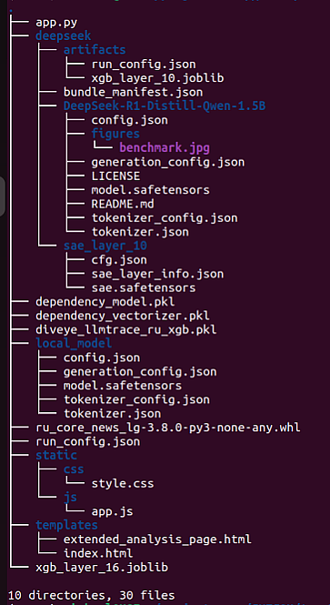

# tRUe@Words

tRUe@Words — веб-приложение для анализа русскоязычных текстов и определения, написаны ли они человеком или сгенерированны с помощью ИИ.

Проект объединяет несколько подходов к анализу текста:

- лингвистический детектор на основе синтаксических признаков
- статистический детектор по surprisal-признакам
- детектор на основе признаков SAE из DeepSeek и классификатора XGBoost

Итоговое решение формируется на основе ансамбля моделей.

## Что находится в проекте

В корневой директории проекта для локального запуска должны лежать следующие файлы и папки:

- `dependency_vectorizer.pkl` — TF-IDF векторизатор для лингвистического детектора
- `dependency_model.pkl` — модель лингвистического детектора
- `diveye_llmtrace_ru_xgb.pkl` — XGBoost-модель для статистического детектора
- `xgb_layer_16.joblib` — XGBoost-модель для SAE/DeepSeek-детектора
- `run_config.json` — конфигурация инференса для SAE/DeepSeek-детектора
- `deepseek/` — локальная папка с моделью DeepSeek-R1-Distill-Qwen-1.5B
- `local_model/` — локальная папка с моделью `rugpt3small_based_on_gpt2`
- `app.py` — Flask-приложение
- `templates/` — HTML-шаблоны
- `static/` — CSS, JS, изображения

## Системные требования

Рекомендуемая среда:

* Python 3.10 или больше
* CPU-режим
* 16 ГБ RAM или больше
* Linux, macOS или Windows

Проект можно запускать и на других версиях Python, но наиболее предсказуемо он собирается в отдельном `venv` на Python 3.10.

## Установка через venv

Ниже приведён порядок установки, который позволяет избежать конфликтов зависимостей.

### 1. Создать виртуальное окружение

#### Linux / macOS

```bash
python3.10 -m venv .venv
source .venv/bin/activate
```

#### Windows PowerShell

```powershell
py -3.10 -m venv .venv
.venv\Scripts\Activate.ps1
```

#### Windows cmd

```cmd
py -3.10 -m venv .venv
.venv\Scripts\activate.bat
```

### 2. Обновить pip, setuptools и wheel

```bash
python -m pip install --upgrade pip setuptools wheel
```

### 3. Установить PyTorch CPU-only вариант

Сначала ставим torch-2.10.0-cpu отдельно, до остальных библиотек:

```bash
pip install https://download.pytorch.org/whl/cpu/torch-2.10.0%2Bcpu-cp310-cp310-manylinux_2_28_x86_64.whl#sha256=a280ffaea7b9c828e0c1b9b3bd502d9b6a649dc9416997b69b84544bd469f215
```

### 4. Установить основной стек зависимостей

Устанавливаем базовые библиотеки до `sae-lens`.

```bash
pip install --prefer-binary \
  "numpy==1.26.4" \
  "pandas==2.2.3" \
  "scipy==1.14.1" \
  "pyarrow==18.1.0" \
  "scikit-learn==1.6.1" \
  "xgboost==2.1.4" \
  "transformers==4.52.4" \
  "accelerate==1.10.1" \
  "datasets==3.6.0" \
  "huggingface_hub==0.34.4" \
  "sentencepiece==0.2.0" \
  "joblib==1.4.2" \
  "matplotlib==3.10.0" \
  "seaborn==0.13.2" \
  "Flask==3.1.0" \
  "lightgbm==4.6.0" \
  "tqdm==4.67.1" \
  "safetensors==0.5.3" \
  "transformer-lens==2.17.0" \
  "spacy==3.7.5" \
  "simple-parsing==0.1.8"
```

### 5. Установить `sae-lens`

`sae-lens` ставим в самом конце.

```bash
pip install --prefer-binary --no-deps "sae-lens==6.37.6"
```

Такая последовательность нужна, чтобы избежать долгого перебора версий `transformers` и связанных библиотек.

### 6. Установить русскоязычную модель spaCy

```bash
python -m spacy download ru_core_news_lg
```
Рекомендуется ru_core_news_lg-3.8.0-py3-none-any.whl

### 7. Проверить, что всё импортируется

```bash
python -c "import torch, spacy, xgboost, transformers; from sae_lens import SAE; print('OK')"
```

Если команда выводит `OK`, окружение установлено корректно.

## Структура локальных моделей

### Папка `deepseek/`

Внутри должны лежать стандартные файлы Transformers-модели, например:

* `config.json`
* `generation_config.json`
* `tokenizer.json`
* `tokenizer.model`
* `tokenizer_config.json`
* `model.safetensors`


### Папка `local_model/`

Внутри должны лежать файлы локальной модели `rugpt3small_based_on_gpt2`, например:

* `config.json`
* `generation_config.json`
* `model.safetensors`
* `tokenizer_config.json`
* `tokenizer.json`

## Как скачать Gemma 2 2B локально

Если у вас есть доступ к модели на Hugging Face, её можно скачать в отдельную папку так:

```python
from huggingface_hub import login, snapshot_download
from getpass import getpass

hf_token = getpass("HF token: ").strip()
login(token=hf_token)

snapshot_download(
    repo_id="deepseek-ai/DeepSeek-R1-Distill-Qwen-1.5B",
    local_dir="./deepseek"
)
```

После этого папка `deepseek` должна лежать в корне проекта.

## Локальный запуск проекта

После установки зависимостей и подготовки моделей запускаем Flask-приложение:

```bash
python app.py
```

После запуска откройте браузер и перейдите по адресу:

```text
http://127.0.0.1:5001
```

## Что должно обязательно лежать в корне проекта

Минимальный набор для запуска:

* `app.py`
* `dependency_vectorizer.pkl`
* `dependency_model.pkl`
* `diveye_llmtrace_ru_xgb.pkl`
* `xgb_layer_16.joblib`
* `run_config.json`
* папка `deepseek/`
* папка `local_model/`
* папки `templates/` и `static/`

Структура директорий делжна быть такой:




## Как работает запуск

При старте приложения инициализируются:

* лингвистический детектор
* статистический детектор
* SAE/deepseek/XGBoost детектор


## Типичные проблемы и решения

### 1. Hugging Face требует доступ к deepseek

Если при попытке скачать deepseek появляется ошибка доступа, значит:

* вы не вошли в Hugging Face
* у аккаунта нет доступа к gated-модели
* лицензия не принята

Сначала получите доступ к `deepseek-ai/DeepSeek-R1-Distill-Qwen-1.5B`, потом выполните логин и только после этого скачивайте модель.

### 2. Интерфейс начинает тормозить после добавления Gemma

DeepSeek-R1-Distill-Qwen-1 в CPU-режиме может заметно нагружать систему. Если интерфейс становится менее отзывчивым:

* проверьте потребление RAM и CPU
* ограничьте число потоков PyTorch
* при необходимости вынесите тяжёлый детектор в отдельный сервис

## Пример запуска с установленным локальным DeepSeek-R1-Distill-Qwen-1

### Linux / macOS

```bash
source .venv/bin/activate
python app.py
```

### Windows PowerShell

```powershell
.venv\Scripts\Activate.ps1
python app.py
```

